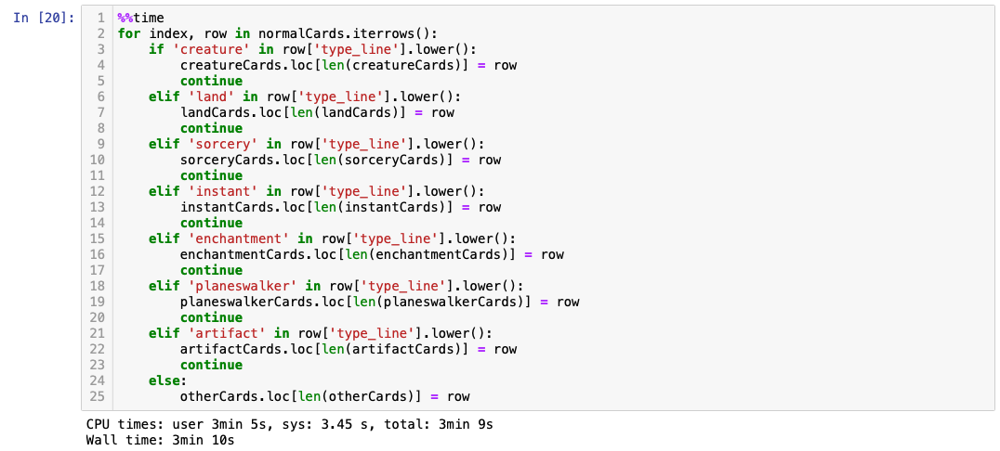
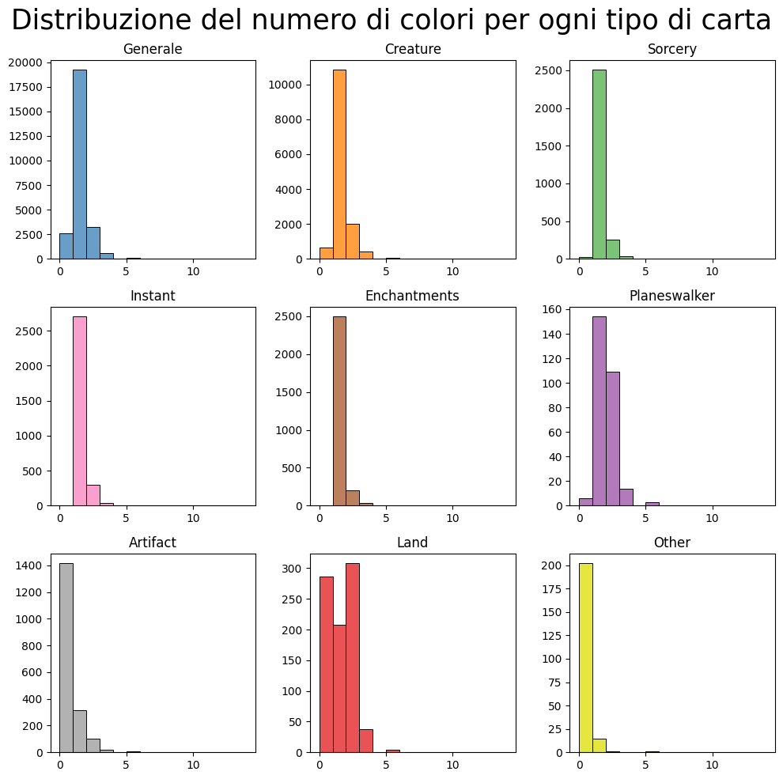
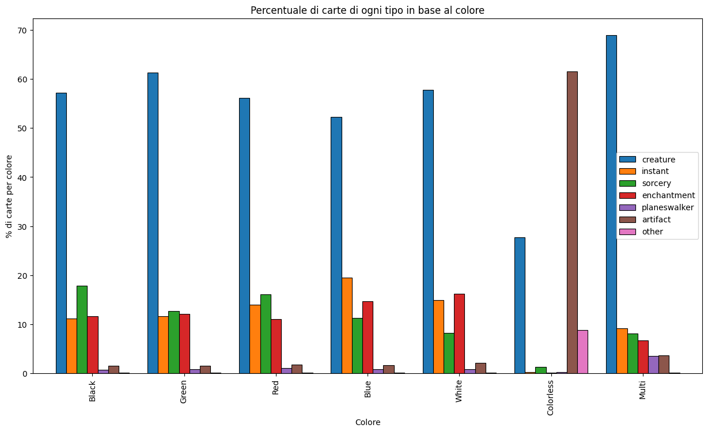
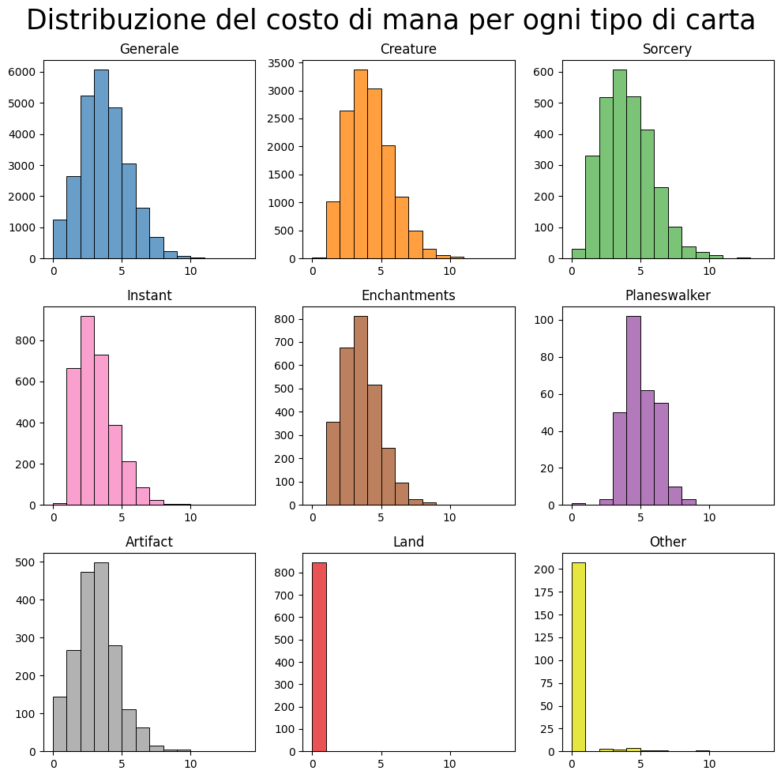
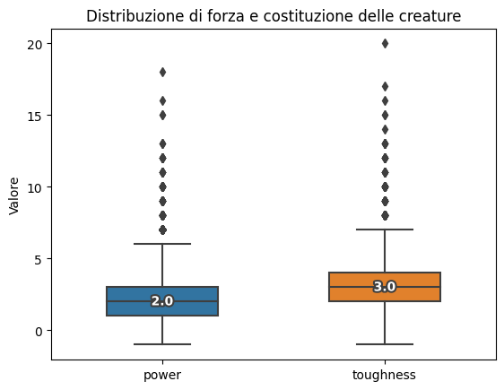
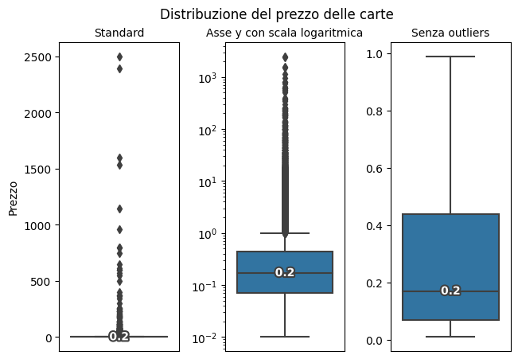
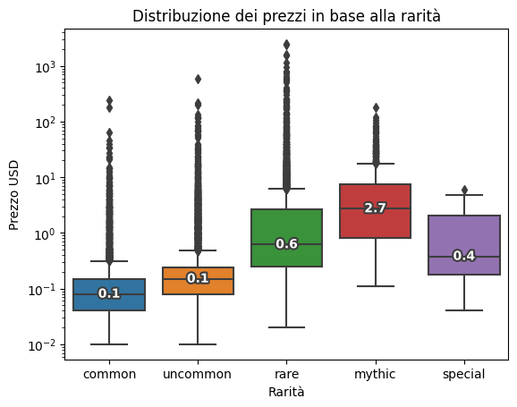
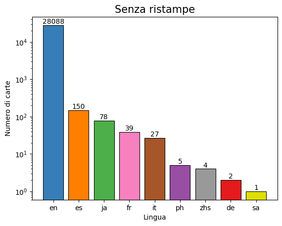

# Visualizzazione Scientifica con Magic the Gathering

Magic the Gathering è un gioco di carte collezionabili (il primo mai esistito) nato nel 1993 e tuttora molto in voga. Lo scopo del gioco è sfidare gli avversari tramite la creazione di un mazzo personalizzato composto da diverse tipologie di carte e sconfiggerli riducendo i loro punti vita a zero.
Attualmente conta più di 25.000 carte. 


## Carte
Ogni carta è caratterizzata da uno o da una combinazione dei 5 colori presenti nel gioco. Esistono anche delle carte definite 'colorless'. Ogni colore è associato ad un insieme di caratteristiche e stili di gioco.

<p align="center">
  
</p>

Gli elementi che ci interessano sono:

* Nome (in alto)
* Costo di mana (in alto a destra)
* Tipo (subito sotto all'immagine)
* Rarità (è indicata dal colore del simbolo che si trova di fianco al tipo)
* Forza e costituzione nel caso delle creature (in basso a destra)

## Dataset
Il dataset utilizzato è reperibile sul sito di [Scryfall](https://scryfall.com/docs/api/bulk-data) alla voce **defalut cards** ed è aggiornato giornalmente. Il dataset è in formato JSON e contiene un oggetto per ogni carta presente nel database del sito in lingua inglese o in un altro linguaggio di stampa nel caso la carta esistesse solo in quel linguaggio. È stata eseguita una pulizia preliminare del dataset e per ogni carta sono stati considerati solamente gli attributi utili allo scopo del progetto:

* Nome (```name```)
* Lingua (```lang```)
* Layout (```layout```)
* Tipo (```type_line```)
* ID MTG Arena (```arena_id```)
* ID MTG Online (```mtgo_id```)
* Costo di mana (```mana_cost```)
* Costo di mana convertito (```cmc```)
* Identità di colore (```color_identity```)
* Colori della carta (```colors```)
* Ranking EDHREC (```edhrec_rank```)
* Forza (```power```)
* Costituzione (```toughness```)
* Prezzi (```prices```)
* Rarità (```rarity```)
* Set di appartenenza (```set_name```)

È successivamente stata aggiunta una colonna che contiene il numero di colori di ogni carta, utile per alcuni conteggi eseguiti. 

<p align="center">
  
</p>

Ogni carta presenta un tipo e un sottotipo. Per come è strutturato il dataset, compare una voce per ogni possibile combinazione di questi due elementi.

<p align="center">
  
</p>

È stata quindi eseguita un'operazione per suddividere le carte in dei dataset ristretti, uno per ciascuno dei 7 tipi principali che verranno illustrati più avanti.

<p align="center">
  
</p>

Come si può notare il tempo di esecuzione del codice non è trascurabile, tuttavia questa suddivisione permette di facilitare numerose operazioni di conteggio svolte successivamente.


## Colori

Come già accennato esistono 5 colori principali nel gioco. Ogni carta può essere di un solo colore, di più colori o colorless. I colori sono importanti perchè sono associati ad elementi simbolici della lore e determinano determinati stili di gioco.

* **Bianco**: le carte di questo colore sono associate alla lealtà, alla protezione e alla guarigione. I mazzi bianchi possono vantare solitamente un gran numero di creature con abilità difensive e abilità di cura.
* **Blu**: colore associato ai trucchi mentali e al controllo. I mazzi blu sono noti per la loro abilità nel rallentare i nemici manipolando il gioco e disturbando le loro strategie.
* **Nero**: associato al caos, alla morte e alla paura. Sono mazzi spesso aggressivi e con abilità che sottraggono vita e portano alla distruzione delle carte avversarie.
* **Rosso**: simboleggia la passione e l'impulsività. I giocatori di mazzi rossi tendono ad attaccare direttamente i loro avversari infliggendo danni rapidamente e con grande forza.
* **Verde**: rappresenta la natura, la crescita e la forza fisica. I mazzi verdi presentano una vasta gamma di creature potenti e abilità di crescita che ne accrescono il potere nel corso del gioco.

Un mazzo può essere composto da carte di un solo colore o di più colori.

Esistono numerose combinazioni di colori:

<p align="center">
  
</p>

Per convenienza le carte che presentano più di un colore verranno catalogate semplicemente come **multicolore**.


Come possiamo osservare dai seguenti grafici (torta e barre) la distribuzione dei colori all'interno della totalità delle carte è abbastanza omogenea. 

<p align="center">
  
</p>

<p align="center">
  
</p>


Inoltre, come possiamo osservare dai seguenti istogrammi, la maggior parte delle carte presenta un solo colore, eccezion fatta per artefatti e terre dove prevalgono rispettivamente zero colori e 2 colori. 

<p align="center">
  
</p>

##Tipi

Esistono 7 tipi principali di carte:

* **Terre**: rappresentano la base di ogni mazzo. Forniscono il *mana*, ovvero la risorsa che permette ai giocatori di giocare le altre carte. È possibile giocarne solamente una per turno e ogni mazzo ne contiene un numero che consenta un equilibrio di gioco.
* **Creature**: rappresentano un insieme variegato di esseri leggendari, bestie e altri personaggi e possono attaccare gli avversari e difendere chi le gioca. Hanno statistiche come forza e costituzione che determinano rispettivamente quanti danni infliggono e possono sopportare. Possono anche avere abilità particolari che influenzano il gioco.
* **Incantesimi**: i giocatori utilizzano gli incantesimi per esercitare il controllo sul campo di battaglia e sfidare i loro avversari. Gli incantesimi possono influenzare e manipolare il gioco in vari modi: possono danneggiare creature, consentire al giocatore di pescare nuove carte, bloccare gli avversari, ecc. Una volta lanciati restano sul campo di battaglia finchè non vengono distrutti o rimossi da altre carte.
* **Stregonerie**: le stregonerie sono simili agli incantesimi, ma vengono lanciate e hanno effetto immediato. Una volta giocate, vengono messe nel cimitero del giocatore, a meno che non specificamente indicato altrimenti. Le stregonerie sono spesso utilizzate per causare danni diretti, distruggere carte dei giocatori avversari o ottenere benefici a breve termine.
* **Istantanei**: gli istantanei sono simili alle stregonerie, ma possono essere giocati in qualsiasi momento durante il proprio turno o in risposta alle azioni dell'avversario. Gli istantanei hanno un effetto immediato e possono essere usati per reagire a situazioni inaspettate o per interferire con i piani dell'avversario. Dopo essere stati giocati, gli istantanei vengono anche mandati al cimitero del giocatore.
* **Planeswalker**:sono particolari carte che rappresentano personaggi potenti nel gioco. Sono degli "alleati" di chi li gioca e possono essere considerati come giocatori in partita. Hanno dei punti vita e delle abilità e possono essere attaccati e sconfitti.
* **Artefatti**: rappresentano oggetti o dispositivi magici che forniscono vantaggi al giocatore e interferiscono con le strategie degli avversari.


Dai seguenti grafici possiamo osservare che, a differenza della distribuzione dei colori che risultava omogenea, per quanto riguarda il tipo delle carte abbiamo una forte presenza di creature, che rappresentano il 56% della totalità delle carte. Notiamo una bassissima presenza di planeswalker e carte diverse dai tipi principali, mentre per istantanei, incantesimi e stregonerie i numeri sono abbastanza simili.

<p align="center">
  
</p>

<p align="center">
  
</p>


## Tipo e colore
Vediamo ora alcuni grafici che mettono in relazione il tipo e il colore delle cate. 
Osserviamo che la percentuale di carte per colore in base al tipo è abbastanza omogenea per quanto riguarda creature, istantanei, incantesimi e stregonerie, mentre abbiamo un forte sbilanciamento verso il multicolore per i planeswalker e verso il colorless per gli artefatti. Si può inoltre osservare che la quasi totalità delle carte non facente parte dei tipi non convenzionali sono colorless.

<p align="center">
  
</p>

Per quanto riguarda il discorso inverso, come facilmente intuibile dai dati riguardanti la distribuzione dei tipi, si osserva che tutti i colori sono dominati dalle creature mentre la presenza delle altre tipologie segue a grandi linee l'andamento della distribuzione dei tipi vista in precedenza. Fanno eccezione solamente le carte colorless che sono per la maggior parte artefatti.

<p align="center">
  
</p>

## Mana
Dai seguenti istogrammi possiamo osservare che la maggior parte delle carte ha un costo di mana compreso tra 2 e 4 con picco in 3, ad eccezione ovviamente delle terre che hanno costo 0.

<p align="center">
  
</p>

Si può fare un discorso particolare per le creature. Come si osserva dal seguente grafico a dispersione si può osservare che esiste una correlazione tra la forza e la costituzione delle creature e il loro costo in mana. Infatti, all'aumentare della statistica aumenta anche il costo di mana. 

<p align="center">
  
</p>

Dai seguenti boxplot si può osservare la distribuzione di forza e costituzione nelle creature.

<p align="center">
  
</p>

## Rarità e prezzo
All'interno del dataset sono presenti carte con le seguenti rarità, in ordine dalla meno importante alla più importante:

* Comuni
* Non comuni
* Rare
* Mitiche
* Speciali

La rarità speciale a dire il vero comprende più rarità ed è presente in bassissima percentuale, la più bassa tra tutte. 
La rarità più presente è comune seguita da rare e non comuni in numero quasi uguale tra loro e infine da mitiche.

È interessante verificare se esistono correlazioni tra la rarità delle carte e il loro prezzo. 
La valuta considerata per i prezzi è il dollaro. 

<p align="center">
  
</p>

Possiamo osservare che in generale la mediana dei prezzi delle carte si aggira sui 20 centesimi di dollaro, con picchi fino a 2500 come si può vedere dagli outliers. Il picco in realtà non è veritiero in quanto carte come Black Lotus possono arrivare a costare molto di più. La maggior parte delle carte comunque ha prezzi compresi tra poco meno di 10 centesimi e poco più di 40.
Se però consideriamo le carte suddivise in base alla rarità le cose cambiano. Notiamo infatti che tendenzialmente il prezzo sale con la rarità e che le carte più costose sono le mitiche.

<p align="center">
  
</p>

Nel dataset abbiamo a disposizione un altro dato che può essere messo in relazione al prezzo delle carte, ovvero il ranking EDHREC. EDHREC è un sito dedicato a commander, ovvero il formato di Magic più giocato con mazzi composti da 100 carte tutte diverse tra loro. Tale sito ha attribuito ad ogni carta un ranking che ne indica la popolarità nel formato. Dal grafico a dispersione possiamo osservare che esiste una debole correlazione tra ranking e prezzo delle carte. Infatti a ranking più alti (valori più bassi dell'asse x) equivalgono prezzi tendenzialmente più alti. 

<p align="center">
  
</p>


## Espansioni e lingue

Le espansioni in Magic sono nuovi set di carte che vengono rilasciati periodicamente per ampliare il gioco. Ogni espansione presenta nuovi personaggi, luoghi e storie all'interno dell'universo immaginario di Magic. Di solito, le espansioni sono composte da centinaia di carte nuove ma possono contenere anche ristampe di carte già esistenti. 
Vediamo quindi innanzitutto quante delle carte esistenti sono carte "uniche" e quante invece sono ristampe. È importante sottolineare che per tutti i dati estratti dal dataset ogni carta è stata considerata una sola volta nel caso in cui fossero presenti ristampe di tale carta.

<p align="center">
  
</p>

Vediamo ora un grafico che mostra le espansioni nelle quali sono state rilasciate più carte.

<p align="center">
  
</p>

È inoltre possibile concludere confrontando i due grafici che seguono che alcune lingue non presentano carte uniche ma solamente ristampe di carte già esistenti in altre lingue. 

<p align="center">
  
</p>

<p align="center">
  
</p>

## Giochi online
Vediamo infine alcuni dati riguardanti le versioni online di Magic. Ne esistono 2: MTG Online e MTG Arena. La principale differenza tra i due è che MTGO è considerato più adatto per i giocatori competitivi, in quanto offre tornei tradizionali e ha un formato più ampio. MTGA ha un focus maggiore sugli eventi e sul gioco casuale, rendendolo più accessibile per i giocatori meno esperti o occasionali. Il primo risulta più costoso del secondo e come osserveremo dai grafici che seguono presenta un numero maggiore di carte. 

### MTG Arena

<p align="center">
  
</p>

<p align="center">
  
</p>

### MTG Online

<p align="center">
  
</p>

<p align="center">
  
</p>


